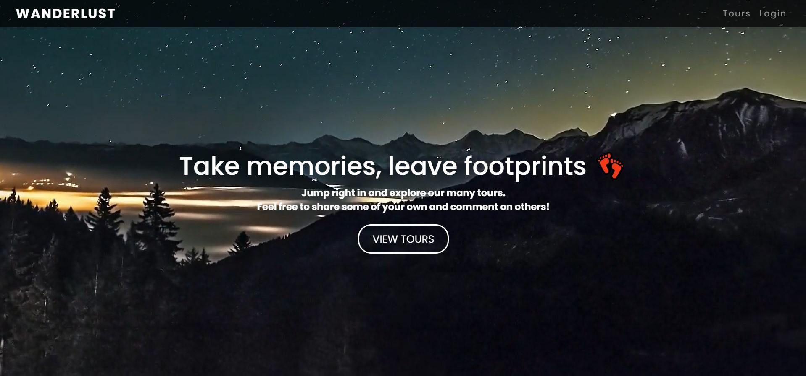
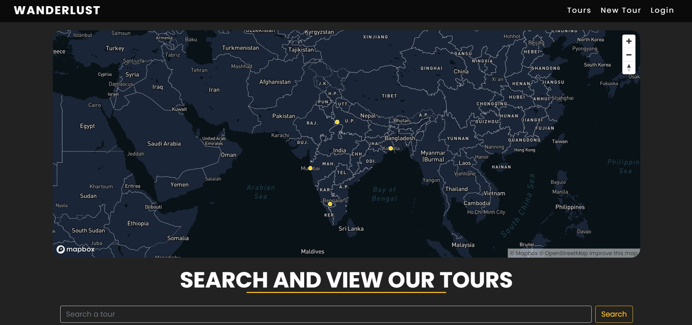
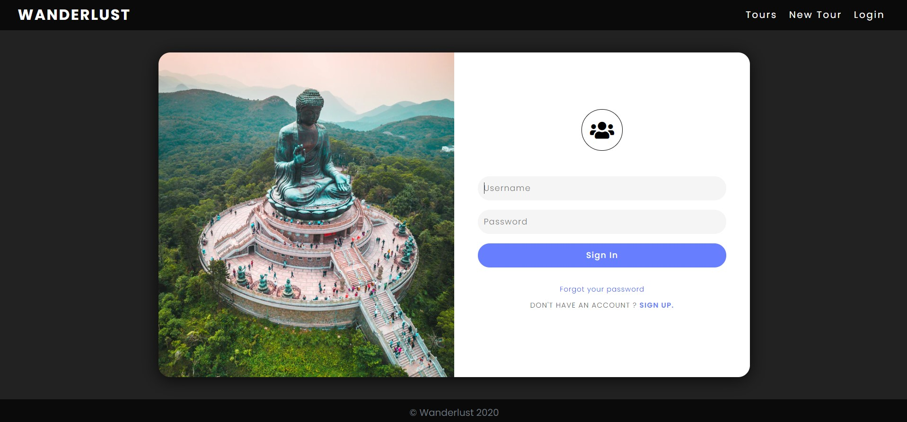
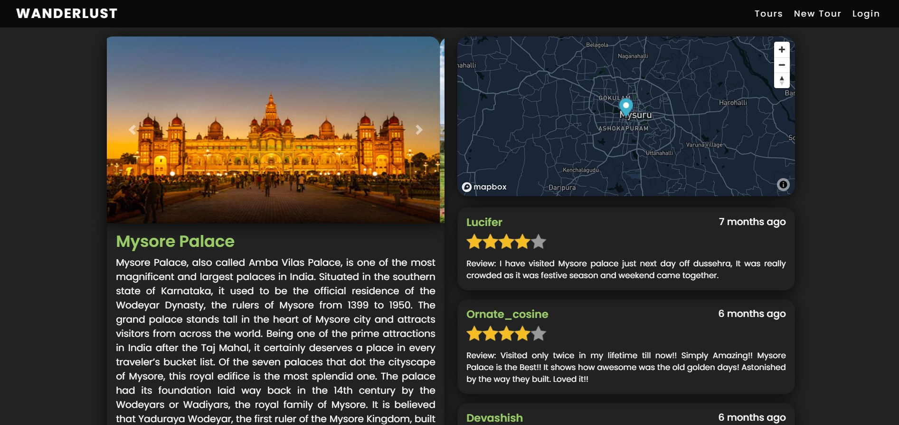

# Travelling Website

 

A Tour & Travel Website made using Node.js, Express, Passport.js (authentication), MongoDB, Nodemailer (for sending email to a user)

The application is composed of the following Features:

### Front-End
* A landing page with animated minimalistic design, with the tagline of our Website.
* Tours Page containing a map consisting of geographical location of all tours, search bar to search a particular tour & list of 4 tours on a single page.
* A page with Sign-in and Sign-out components.
* An individual tour page containing reviews & information of a particular tour. 
* A review Page to rate & give a review to a particular tour.


### Backend
* As of this moment I am using Mongodb for storing all data & passport.js for user authentication.
* It is also used to store user data 
* I am using REST APIs for routing between different pages.
* Any user can perform CRUD operations.
* Also, there is an admin role with certain privileges.

**SCREENSHOTS:**

Landing Page:


---
Tours Preview:


---
Sign-in && Sign-Up Page:


---
Individual Tour Section:



---

## Developed With

* [Visual Studio Code](https://code.visualstudio.com/) - A source code editor developed by Microsoft for Windows, Linux and macOS. It includes support for debugging, embedded Git control, syntax highlighting, intelligent code completion, snippets, and code refactoring
* [NodeJS](https://nodejs.org/en/) - A JavaScript runtime built on Chrome's V8 JavaScript engine.
* [MongoDB](https://www.mongodb.com/) - A general purpose, document-based, distributed database built for modern application developers and for the cloud
* [Cloudinary](https://cloudinary.com/) - Cloudinary’s mission is to help companies unleash the full potential of their media to create the most engaging visual experiences.

---

## Quick Start

Clone the repository and do following:

```bash
# Install dependencies for server
npm install

# Run the client 
nodemon app.js

# Server runs on http://localhost:3000
```